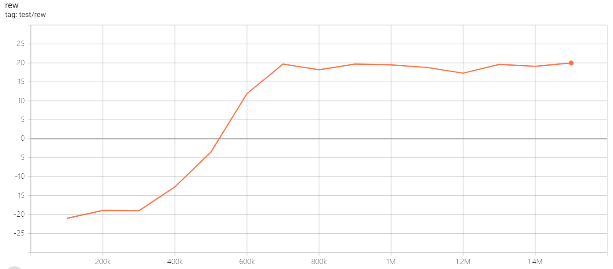
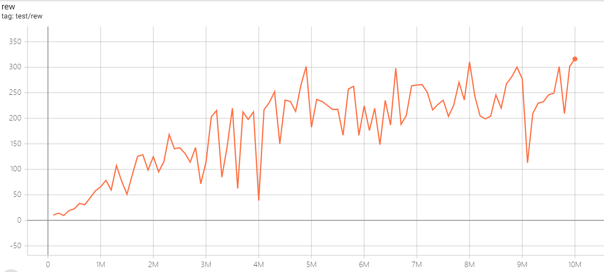
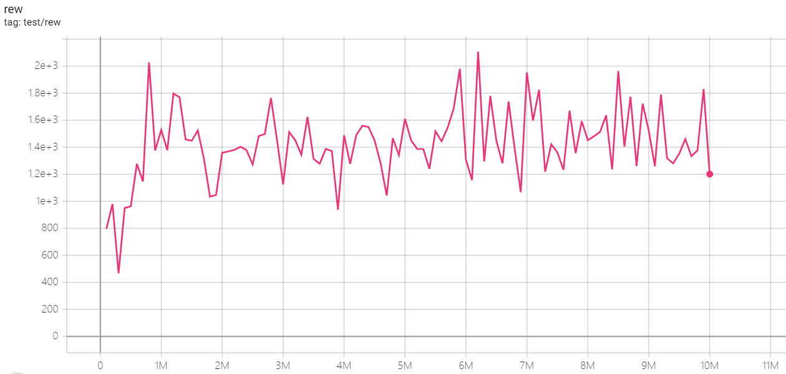
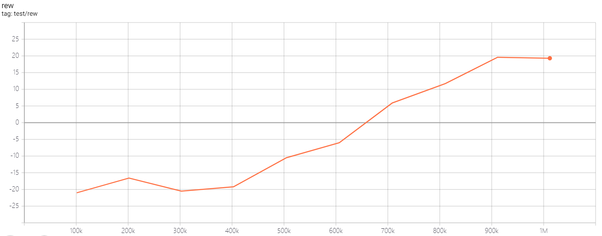
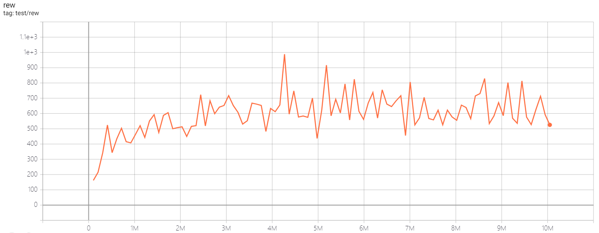
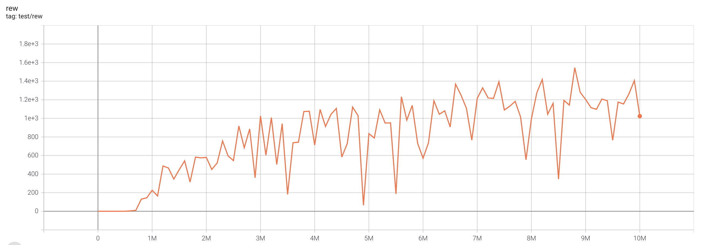
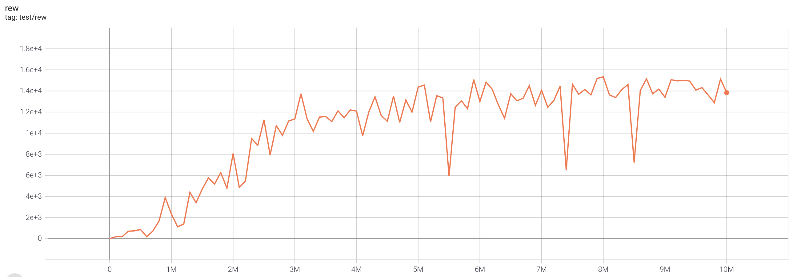
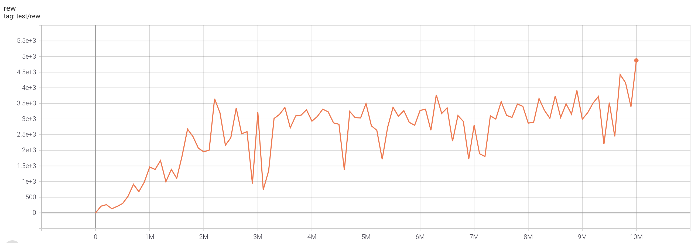

# Atari General

The sample speed is \~3000 env step per second (\~12000 Atari frame per second in fact since we use frame_stack=4) under the normal mode (use a CNN policy and a collector, also storing data into the buffer). The main bottleneck is training the convolutional neural network.

The Atari env seed cannot be fixed due to the discussion [here](https://github.com/openai/gym/issues/1478), but it is not a big issue since on Atari it will always have the similar results.

The env wrapper is a crucial thing. Without wrappers, the agent cannot perform well enough on Atari games. Many existing RL codebases use [OpenAI wrapper](https://github.com/openai/baselines/blob/master/baselines/common/atari_wrappers.py), but it is not the original DeepMind version ([related issue](https://github.com/openai/baselines/issues/240)). Dopamine has a different [wrapper](https://github.com/google/dopamine/blob/master/dopamine/discrete_domains/atari_lib.py) but unfortunately it cannot work very well in our codebase.

# DQN (single run)

One epoch here is equal to 100,000 env step, 100 epochs stand for 10M.

| task                        | best reward | reward curve                          | parameters                                                   | time cost           |
| --------------------------- | ----------- | ------------------------------------- | ------------------------------------------------------------ | ------------------- |
| PongNoFrameskip-v4          | 20          |          | `python3 atari_dqn.py --task "PongNoFrameskip-v4" --batch-size 64` | ~30 min (~15 epoch) |
| BreakoutNoFrameskip-v4      | 316         |      | `python3 atari_dqn.py --task "BreakoutNoFrameskip-v4" --test-num 100`  | 3~4h (100 epoch)    |
| EnduroNoFrameskip-v4        | 670         |        | `python3 atari_dqn.py --task "EnduroNoFrameskip-v4 " --test-num 100`  | 3~4h (100 epoch)    |
| QbertNoFrameskip-v4         | 7307        |         | `python3 atari_dqn.py --task "QbertNoFrameskip-v4" --test-num 100`  | 3~4h (100 epoch)    |
| MsPacmanNoFrameskip-v4      | 2107        |      | `python3 atari_dqn.py --task "MsPacmanNoFrameskip-v4" --test-num 100`  | 3~4h (100 epoch)    |
| SeaquestNoFrameskip-v4      | 2088        |      | `python3 atari_dqn.py --task "SeaquestNoFrameskip-v4" --test-num 100`  | 3~4h (100 epoch)    |
| SpaceInvadersNoFrameskip-v4 | 812.2       |  | `python3 atari_dqn.py --task "SpaceInvadersNoFrameskip-v4" --test-num 100`  | 3~4h (100 epoch)    |

Note: The `eps_train_final` and `eps_test` in the original DQN paper is 0.1 and 0.01, but [some works](https://github.com/google/dopamine/tree/master/baselines) found that smaller eps helps improve the performance. Also, a large batchsize (say 64 instead of 32) will help faster convergence but will slow down the training speed. 

We haven't tuned this result to the best, so have fun with playing these hyperparameters!

# C51 (single run)

One epoch here is equal to 100,000 env step, 100 epochs stand for 10M.

| task                        | best reward | reward curve                          | parameters                                                   |
| --------------------------- | ----------- | ------------------------------------- | ------------------------------------------------------------ |
| PongNoFrameskip-v4          | 20          |          | `python3 atari_c51.py --task "PongNoFrameskip-v4" --batch-size 64` |
| BreakoutNoFrameskip-v4      | 536.6         |      | `python3 atari_c51.py --task "BreakoutNoFrameskip-v4" --n-step 1` |
| EnduroNoFrameskip-v4        | 1032         |        | `python3 atari_c51.py --task "EnduroNoFrameskip-v4 " ` |
| QbertNoFrameskip-v4         | 16245        |         | `python3 atari_c51.py --task "QbertNoFrameskip-v4"`  |
| MsPacmanNoFrameskip-v4      | 3133        |      | `python3 atari_c51.py --task "MsPacmanNoFrameskip-v4"`  |
| SeaquestNoFrameskip-v4      | 6226        |      | `python3 atari_c51.py --task "SeaquestNoFrameskip-v4"`  |
| SpaceInvadersNoFrameskip-v4 | 988.5      |  | `python3 atari_c51.py --task "SpaceInvadersNoFrameskip-v4"`  |

Note: The selection of `n_step` is based on Figure 6 in the [Rainbow](https://arxiv.org/abs/1710.02298) paper.

# QRDQN (single run)

One epoch here is equal to 100,000 env step, 100 epochs stand for 10M.

| task                        | best reward | reward curve                          | parameters                                                   |
| --------------------------- | ----------- | ------------------------------------- | ------------------------------------------------------------ |
| PongNoFrameskip-v4          | 20          |          | `python3 atari_qrdqn.py --task "PongNoFrameskip-v4" --batch-size 64` |
| BreakoutNoFrameskip-v4      | 409.2         |      | `python3 atari_qrdqn.py --task "BreakoutNoFrameskip-v4" --n-step 1` |
| EnduroNoFrameskip-v4      | 1055.9        |      | `python3 atari_qrdqn.py --task "EnduroNoFrameskip-v4"`  |
| QbertNoFrameskip-v4         | 14990        |         | `python3 atari_qrdqn.py --task "QbertNoFrameskip-v4"`  |
| MsPacmanNoFrameskip-v4      | 2886        |      | `python3 atari_qrdqn.py --task "MsPacmanNoFrameskip-v4"`  |
| SeaquestNoFrameskip-v4      | 5676        |      | `python3 atari_qrdqn.py --task "SeaquestNoFrameskip-v4"`  |
| SpaceInvadersNoFrameskip-v4      | 938        |      | `python3 atari_qrdqn.py --task "SpaceInvadersNoFrameskip-v4"`  |

# IQN (single run)

One epoch here is equal to 100,000 env step, 100 epochs stand for 10M.

| task                        | best reward | reward curve                          | parameters                                                   |
| --------------------------- | ----------- | ------------------------------------- | ------------------------------------------------------------ |
| PongNoFrameskip-v4          | 20.2        |          | `python3 atari_iqn.py --task "PongNoFrameskip-v4" --batch-size 64` |
| BreakoutNoFrameskip-v4      | 450.2       |      | `python3 atari_iqn.py --task "BreakoutNoFrameskip-v4" --n-step 1` |
| EnduroNoFrameskip-v4        | 1883.6      |        | `python3 atari_iqn.py --task "EnduroNoFrameskip-v4"`  |
| QbertNoFrameskip-v4         | 15837.5     |         | `python3 atari_iqn.py --task "QbertNoFrameskip-v4"`  |
| MsPacmanNoFrameskip-v4      | 3304        |      | `python3 atari_iqn.py --task "MsPacmanNoFrameskip-v4"`  |
| SeaquestNoFrameskip-v4      |         |      | `python3 atari_iqn.py --task "SeaquestNoFrameskip-v4"`  |
| SpaceInvadersNoFrameskip-v4 |          |  | `python3 atari_iqn.py --task "SpaceInvadersNoFrameskip-v4"`  |

# BCQ

To running BCQ algorithm on Atari, you need to do the following things:

- Train an expert, by using the command listed in the above DQN section;
- Generate buffer with noise: `python3 atari_dqn.py --task {your_task} --watch --resume-path log/{your_task}/dqn/policy.pth --eps-test 0.2 --buffer-size 1000000 --save-buffer-name expert.hdf5` (note that 1M Atari buffer cannot be saved as `.pkl` format because it is too large and will cause error);
- Train BCQ: `python3 atari_bcq.py --task {your_task} --load-buffer-name expert.hdf5`.

We test our BCQ implementation on two example tasks (different from author's version, we use v4 instead of v0; one epoch means 10k gradient step):

| Task                   | Online DQN | Behavioral | BCQ                               |
| ---------------------- | ---------- | ---------- | --------------------------------- |
| PongNoFrameskip-v4     | 21         | 7.7        | 21 (epoch 5)                      |
| BreakoutNoFrameskip-v4 | 303        | 61         | 167.4 (epoch 12, could be higher) |

# CQL

To running CQL algorithm on Atari, you need to do the following things:

- Train an expert, by using the command listed in the above QRDQN section;
- Generate buffer with noise: `python3 atari_qrdqn.py --task {your_task} --watch --resume-path log/{your_task}/qrdqn/policy.pth --eps-test 0.2 --buffer-size 1000000 --save-buffer-name expert.hdf5` (note that 1M Atari buffer cannot be saved as `.pkl` format because it is too large and will cause error);
- Train CQL: `python3 atari_cql.py --task {your_task} --load-buffer-name expert.hdf5`.

We test our CQL implementation on two example tasks (different from author's version, we use v4 instead of v0; one epoch means 10k gradient step):

| Task                   | Online QRDQN | Behavioral | CQL                               | parameters                                                   |
| ---------------------- | ---------- | ---------- | --------------------------------- | ------------------------------------------------------------ |
| PongNoFrameskip-v4     | 20.5         | 6.8        | 19.5 (epoch 5)                      | `python3 atari_cql.py --task "PongNoFrameskip-v4" --load-buffer-name log/PongNoFrameskip-v4/qrdqn/expert.hdf5 --epoch 5` |
| BreakoutNoFrameskip-v4 | 394.3        | 46.9       | 248.3 (epoch 12) | `python3 atari_cql.py --task "BreakoutNoFrameskip-v4" --load-buffer-name log/BreakoutNoFrameskip-v4/qrdqn/expert.hdf5 --epoch 12 --min-q-weight 50` |

We reduce the size of the offline data to 10% and 1% of the above and get:

Buffer size 100000:

| Task                   | Online QRDQN | Behavioral | CQL                               | parameters                                                   |
| ---------------------- | ---------- | ---------- | --------------------------------- | ------------------------------------------------------------ |
| PongNoFrameskip-v4     | 20.5         | 5.8        | 21 (epoch 5)                      | `python3 atari_cql.py --task "PongNoFrameskip-v4" --load-buffer-name log/PongNoFrameskip-v4/qrdqn/expert.size_1e5.hdf5 --epoch 5` |
| BreakoutNoFrameskip-v4 | 394.3        | 41.4       | 40.8 (epoch 12) | `python3 atari_cql.py --task "BreakoutNoFrameskip-v4" --load-buffer-name log/BreakoutNoFrameskip-v4/qrdqn/expert.size_1e5.hdf5 --epoch 12 --min-q-weight 20` |

Buffer size 10000:

| Task                   | Online QRDQN | Behavioral | CQL                               | parameters                                                   |
| ---------------------- | ---------- | ---------- | --------------------------------- | ------------------------------------------------------------ |
| PongNoFrameskip-v4     | 20.5         | nan        | 1.8 (epoch 5)                      | `python3 atari_cql.py --task "PongNoFrameskip-v4" --load-buffer-name log/PongNoFrameskip-v4/qrdqn/expert.size_1e4.hdf5 --epoch 5 --min-q-weight 1` |
| BreakoutNoFrameskip-v4 | 394.3        | 31.7       | 22.5 (epoch 12) | `python3 atari_cql.py --task "BreakoutNoFrameskip-v4" --load-buffer-name log/BreakoutNoFrameskip-v4/qrdqn/expert.size_1e4.hdf5 --epoch 12 --min-q-weight 10` |

# CRR

To running CRR algorithm on Atari, you need to do the following things:

- Train an expert, by using the command listed in the above QRDQN section;
- Generate buffer with noise: `python3 atari_qrdqn.py --task {your_task} --watch --resume-path log/{your_task}/qrdqn/policy.pth --eps-test 0.2 --buffer-size 1000000 --save-buffer-name expert.hdf5` (note that 1M Atari buffer cannot be saved as `.pkl` format because it is too large and will cause error);
- Train CQL: `python3 atari_crr.py --task {your_task} --load-buffer-name expert.hdf5`.

We test our CRR implementation on two example tasks (different from author's version, we use v4 instead of v0; one epoch means 10k gradient step):

| Task                   | Online QRDQN | Behavioral | CRR            | CRR w/ CQL        | parameters                                                   |
| ---------------------- | ---------- | ---------- | ---------------- | ----------------- | ------------------------------------------------------------ |
| PongNoFrameskip-v4     | 20.5         | 6.8        | -21 (epoch 5)   |  16.1 (epoch 5)  | `python3 atari_crr.py --task "PongNoFrameskip-v4" --load-buffer-name log/PongNoFrameskip-v4/qrdqn/expert.hdf5 --epoch 5` |
| BreakoutNoFrameskip-v4 | 394.3        | 46.9       | 26.4 (epoch 12) | 125.0 (epoch 12) | `python3 atari_crr.py --task "BreakoutNoFrameskip-v4" --load-buffer-name log/BreakoutNoFrameskip-v4/qrdqn/expert.hdf5 --epoch 12 --min-q-weight 50` |

Note that CRR itself does not work well in Atari tasks but adding CQL loss/regularizer helps.
